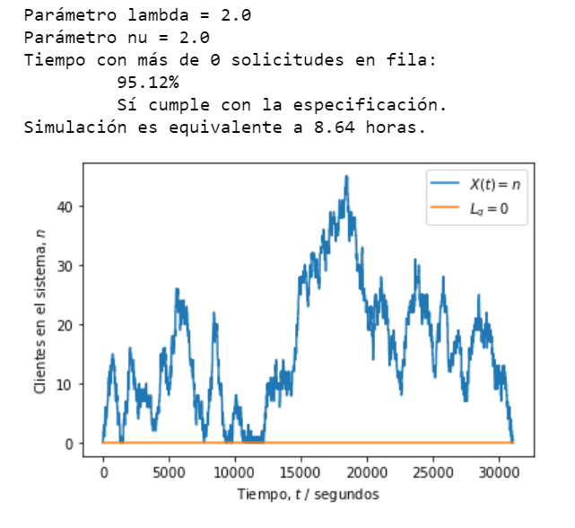
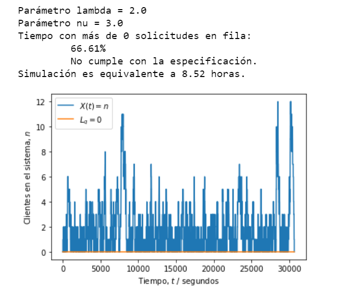

# Laboratorio 5
## Asignaciones

La administración del servicio desea ahora que el servidor no esté vacío (sin atender solicitudes) más del 10% del tiempo. Hallar el parámetro $\nu$ para satisfacer este requisito y modificar el código para medir la variable de interés en una simulación.

---

### Solución

Para resolver esta práctica de laboratorio se utilizó el código del L5_base.ipynb proporcionado. A partir de este se realiza lo siguiente
  1) Con la sumatoria para la cantidad de personas en cola, se calcula el caso en el que la probabilidad de **solicitudes** al servidor sea al menos 1, durante más del 10% del      tiempo, esto es equivalente a buscar la probabilidad P>0.90
  2) Del punto anterior, se encuentra, al resolver la sumatoria, que P(1 o más solicitudes)= (lambda\nu) >= 0.90. Entonces se resuelve para nu y se calcula que nu<=2.2
  3) El valor de nu calculado se debe sustituir en el código para que sea aplicado a la simulación. En el programa se utiliza 2/60. Esto debido a que 2 es menor que 2.2
     lo cual es necesario para cumplir la asignación. Luego, el divisor 60 se utiliza para utilizar las unidades de segundos en lugar de minutos; con el proposito de tener
     gran granularidad.
    
### Resultados

Utilizado nu=2, se debe cumplir la asignación de diseño, tal y como se muestra en la siguiente figura:

 

Utilizado nu=3, se debe incumplir la asignación de diseño, tal y como se muestra en la siguiente figura:

 

